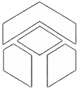

# LabSTX — Frontend Landing Page

<div align="center">



**The premier browser-based development environment for Stacks Blockchain developers.**

[](https://lab-stx.vercel.app/)
[](https://lab-stx-ide.vercel.app/)
[](https://react.dev/)
[](https://www.typescriptlang.org/)
[](https://vitejs.dev/)

</div>

---

## 📖 Overview

This directory contains the **public-facing marketing and landing page** for the LabSTX platform. It is a fully standalone React + Vite application that showcases the IDE's capabilities, features, and workflows to prospective users.

> The actual IDE application (the editor, compiler, AI assistant, wallet integration, etc.) lives in the **[`../IDE`](../IDE)** directory. This marketing site **links to** the deployed IDE at [`https://lab-stx-ide.vercel.app/`](https://lab-stx-ide.vercel.app/).

---

## 🗂️ Project Structure

```
frontend/
├── components/
│   ├── LandingPage.tsx          # Main landing page — hero, features, CTA sections
│   ├── InteractiveMatrixSphere.tsx  # Animated 3D sphere hero visual
│   ├── WorkflowBuilder.tsx      # Interactive workflow builder demo page
│   ├── UnderDevelopment.tsx     # Placeholder page for features in development
│   ├── ModuleCard.tsx           # Reusable feature/module card component
│   ├── NeoButton.tsx            # Neobrutalist-style primary button component
│   ├── Header.tsx               # Shared header/navigation bar
│   └── Sidebar.tsx              # Shared sidebar navigation
├── public/
│   ├── lab_stx.png              # Dark-mode logo
│   └── lab_stx_whitee.png       # Light-mode logo
├── App.tsx                      # Root router — handles page state (landing / builder / underdev)
├── index.tsx                    # React entry point
├── index.html                   # HTML shell with Tailwind CDN, Google Fonts, and importmap
├── types.ts                     # Shared TypeScript type definitions
├── vite.config.ts               # Vite configuration
├── tsconfig.json                # TypeScript compiler settings
└── package.json                 # Dependencies and scripts
```

---

## 🚀 Getting Started

### Prerequisites

- [Node.js](https://nodejs.org/) **v18+**
- npm **v9+**

### Installation

```bash
# Navigate to the frontend directory
cd frontend

# Install dependencies
npm install
```

### Development Server

```bash
npm run dev
```

The app will be available at **`http://localhost:3000`** (Vite default port).

### Production Build

```bash
npm run build
```

### Preview Production Build

```bash
npm run preview
```

---

## 🎨 Design System

The frontend uses a **Neobrutalist** design language with:

| Token | Value | Usage |
|---|---|---|
| Primary Blue | `#2d5bff` | Borders, accent lines, interactive states |
| Brand Blue | `#3b82f6` | Buttons, icons, active elements |
| Dark BG | `#000000` / `#1a1a1a` | Dark mode backgrounds |
| Light BG | `#f3f4f6` | Light mode backgrounds |
| Font Display | `Space Grotesk`, `Inter` | Headlines, uppercase labels |
| Font Mono | `Space Mono` | Code snippets, body tertiary |
| Neo Shadow | `4px 4px 0px 0px #2d5bff` | Brutalist card effect |

### Theme Support

The app supports **light and dark themes** toggled by the user. Theme state is managed at the `App.tsx` root and passed down via props. The `data-theme` attribute is applied to `document.documentElement`.

```tsx
// App.tsx — Theme management
const [theme, setTheme] = useState<'light' | 'dark'>('light');

useEffect(() => {
  document.documentElement.setAttribute('data-theme', theme);
  if (theme === 'dark') {
    document.documentElement.classList.add('dark');
  } else {
    document.documentElement.classList.remove('dark');
  }
}, [theme]);
```

---

## 🧩 Component Reference

### `LandingPage.tsx`

The primary marketing page. Contains the following sections:

| Section | Description |
|---|---|
| **Hero** | Full-viewport animated ASCII background with headline and `Start Building` CTA |
| **Marquee** | Auto-scrolling marquee of ecosystem keywords (Stacks, Bitcoin Layers, Clarity SDK…) |
| **SimulationScroll** | Scroll-driven interactive IDE mockup showing Write → Analyze → Debug → Deploy flow |
| **Powerful Features** | 6-card grid showcasing the IDE's core capabilities |
| **Built for Clarity** | Split section explaining the Clarity language with a live code snippet |
| **Tailored For** | Use-case cards (Clarity Mastery, Rapid Prototyping) |
| **Getting Started** | 3-step onboarding guide with launch CTA |
| **Footer** | Links, copyright, ecosystem links, social icons |

Both the **"Launch App"** button in the header and the **"Start Building"** button in the hero open the IDE in a new tab:

```tsx
window.open('https://lab-stx-ide.vercel.app/', '_blank', 'noopener,noreferrer')
```

### `NeoButton.tsx`

A reusable button with the project's neobrutalist border-shadow style. Accepts `variant` (`primary` | `secondary`) and `theme` props.

### `InteractiveMatrixSphere.tsx`

A canvas-based animated sphere rendered as an interactive ASCII/Matrix-style visual used in the hero section.

### `WorkflowBuilder.tsx`

An interactive visual workflow builder page, accessible by navigating to the builder page state. Allows users to connect and visualize smart contract deployment workflows.

### `UnderDevelopment.tsx`

A placeholder component returned when `currentPage === 'underdev'`. Shows a polished "coming soon" view with a back button.

---

## ⚙️ App Routing

The app uses **in-memory state-based routing** (no React Router). Page state is one of:

```ts
'landing' | 'builder' | 'underdev'
```

```tsx
// App.tsx
const [currentPage, setCurrentPage] = useState<'landing' | 'builder' | 'underdev'>('landing');

if (currentPage === 'builder') return <WorkflowBuilder />;
if (currentPage === 'underdev') return <UnderDevelopment onBack={() => setCurrentPage('landing')} theme={theme} />;
return <LandingPage onLaunch={() => setCurrentPage('underdev')} theme={theme} toggleTheme={toggleTheme} />;
```

---

## 🔗 Relationship to the IDE

This landing site is the **public entry point** to the full LabSTX platform. The IDE is a separate application in `../IDE`.

| | Frontend (this directory) | IDE (`../IDE`) |
|---|---|---|
| **Purpose** | Marketing landing page | Full-featured browser IDE |
| **Tech** | React 19, Vite 6, Tailwind CDN | React 18, Vite 6, Monaco Editor, Stacks SDK |
| **Deployed At** | `lab-stx.vercel.app` | `lab-stx-ide.vercel.app` |
| **AI** | — | OpenRouter |
| **Blockchain** | — | Stacks, Casper Network |
| **Wallets** | — | Leather, Xverse |
| **Build Output** | Static HTML/JS/CSS | Static HTML/JS/CSS + WASM |

The landing page's **"Launch App"** and **"Start Building"** buttons navigate the user directly to the deployed IDE instance.

---

## 📦 Dependencies

| Package | Version | Purpose |
|---|---|---|
| `react` | ^19.2.0 | UI framework |
| `react-dom` | ^19.2.0 | DOM rendering |
| `lucide-react` | ^0.555.0 | Icon library (Ghost, ArrowRight, Rocket, etc.) |
| `vite` | ^6.2.0 | Build tool and dev server |
| `@vitejs/plugin-react` | ^5.0.0 | Vite React plugin |
| `typescript` | ~5.8.2 | Type safety |
| `@types/node` | ^22.14.0 | Node.js type definitions |

> **Note:** Tailwind CSS is loaded via **CDN** in `index.html` for the landing page (not installed as an npm package). This is intentional for the marketing site's lightweight setup.

---

## 🌐 Related Repositories & Links

| Resource | URL |
|---|---|
| **Live Landing Page** | [`https://lab-stx-ide.vercel.app/`](https://lab-stx-ide.vercel.app/) |
| **Live IDE App** | [`https://lab-stx-ide.vercel.app/`](https://lab-stx-ide.vercel.app/) |
| **Backend API** | [`https://labstx-ide-api.onrender.com`](https://labstx-ide-api.onrender.com) |
| **Stacks Docs** | [`https://docs.stacks.co`](https://docs.stacks.co) |
| **Clarity Lang** | [`https://clarity-lang.org`](https://clarity-lang.org) |
| **Stacks Explorer** | [`https://explorer.hiro.so`](https://explorer.hiro.so) |

---

## 🧠 IDE Feature Reference

The landing page markets these core features of the IDE (see [`../IDE`](../IDE) for implementation details):

- **Monaco Editor** — VS Code-grade editing experience with full Clarity syntax highlighting
- **Clarity Static Analysis** — In-browser `check` command for post-condition and cost analysis
- **AI Assistant (LabSTX AI)** — Powered by OpenRouter
- **Wallet Integration** — Leather, Xverse (Stacks)
- **Deployment** — One-click deploy to Stacks Mainnet or Testnet
- **GitHub Integration** — OAuth-based GitHub auth, file sync, and repo management
- **File System** — Virtual multi-file workspace with drag-and-drop and ZIP export
- **Debugger** — Step-through Clarity contract execution
- **Terminal Panel** — Output, errors, and diagnostics with copy/locate features
- **Source Control** (soon) — Git status, staging, commits, and branch management panel
- **ABI Preview** — Parsed contract interface viewer (functions, maps, traits)
- **Template Library** (soon)— Starter contracts for SIP-010, SIP-009, Counters, etc.

---

## 🛠️ Development Tips

- **Adding a new landing page section:** Create the section JSX inside `LandingPage.tsx`. Use the `isDark` variable and the established color tokens for theme-aware styling.
- **Adding a new page:** Add a new string to the page state union in `App.tsx`, add the conditional render, and create the page component in `components/`.
- **Updating the CTA URL:** The IDE URL (`https://lab-stx-ide.vercel.app/`) appears in `LandingPage.tsx` in three places — the header "Launch App" button, the hero "Start Building" button, and the "Launch LabSTX IDE" CTA button. Update all three together.
- **Icons:** All icons are from `lucide-react`. Browse the full library at [lucide.dev](https://lucide.dev/).

---

## 📄 License

© 2026 LabSTX. Built for the Stacks Community.
